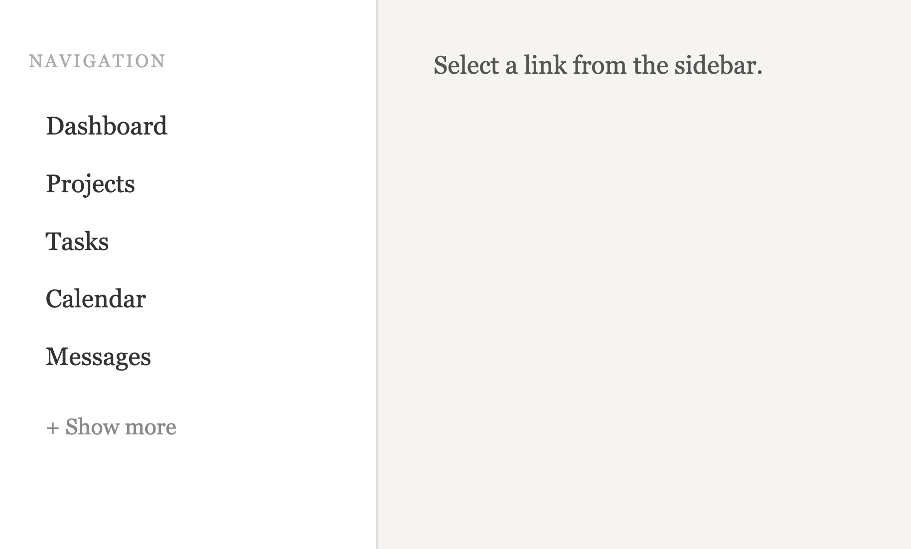

Using AI to generate user interface components is easy. However, not paying attention to web accessibility can exclude users with disabilities. I generated a show more functionality using Claude without any guardrails. I analysed some accessibility issues and will walk you through why they’re important. I will be referencing web accessibility guidelines called <a href="https://www.w3.org/WAI/standards-guidelines/wcag/">WCAG</a>.


## The prompt

Using Claude Chat with a free plan, I asked:

"Create a sidebar with 10 links. The links are limited to 5. The user has the option to show more or show less. Use minimal styling. Create a downloadable file"


The following is the result of the <a href="#claude-generated-code">HTML file</a>:



## Mistake 1: Contrast Ratio
Immediately, I noticed that the contrast ratio of the word “Navigation” and the “Show more” button text were too light against a gray background. <a href="https://developer.chrome.com/docs/lighthouse/overview">Lighthouse</a>, an automated accessibility checker, flagged this too.

Poor contrast is an issue for people with low vision, making it difficult for them to read content. Read more on <a href="https://www.w3.org/WAI/WCAG21/Understanding/contrast-minimum">Contrast Minimum (Level AA)</a>

To fix this, you can validate the contrast ratio of the text and background colours using tools like <a href="https://webaim.org/resources/contrastchecker/">WebAIM Contrast Checker</a> 

## Mistake 2:  Focus Order
I used the Tab key to navigate the links and pressed the Enter key on the “Show more” button. 

<video
  controls
  aria-label="Demo of Claude Code's Show More Button Implementation" aria-details="#transcript-initial"
  poster="./focus-order-claude-generated-preview.png">
  <source src="./focus-order-claude-generated.mp4" type="video/mp4" />
</video>
<details id="transcript-initial">
   <summary>Transcript</summary>
   <p>Sidebar has 5 additional links after clicking "Show more". Focus goes to the "Show less" button, which is at the bottom of the list, skipping 5 links</p>
   …
</details>

The list expanded, showing 5 more items, but the next element in focus jumped to the button at the bottom of the list instead of the sixth link.

Keyboard navigation, an alternative to a mouse, is important for people with mobility impairments. It can get confusing when the focus of the page is inconsistent. Moreover, having the wrong focus order also affects screen reader users, who might miss other content on the page completely. Read more on <a href="https://www.w3.org/WAI/WCAG22/Understanding/focus-order.html">Focus Order (Level A)</a>

To fix this, a developer can add code that moves focus to the first new item after the list expands. See the <a href="#focus-fix-code-snippet">focus fix code snippet</a> if you're interested.

<video
  controls
  width="250"
  aria-label="Demo of Fixed Focus Order"
  aria-details="#transcript-fixed"
  poster="./focus-order-fixed-preview.png">
  <source src="./focus-order-fixed.mp4" type="video/mp4" />
</video>
<details id="transcript-fixed">
   <summary>Transcript</summary>
   <p>Focus ring stays on the 6th item after clicking "Show more", fixing the focus order</p>
   …
</details>

## Final Thoughts
While AI-generated websites are increasing, there are still limitations. According to <a href="https://webaim.org/projects/million/">The WebAIM Million project</a>, over 95% of home pages had WCAG issues. I hope that with more awareness, the use of AI does not make it worse. 

## Code Snippets

### Claude Generated Code

```html
<!DOCTYPE html>
<html lang="en">
  <head>
    <meta charset="UTF-8" />
    <meta name="viewport" content="width=device-width, initial-scale=1.0"/>
    <title>Sidebar</title>
    <style>
      *, *::before, *::after { box-sizing: border-box; margin: 0; padding: 0; }

      body {
        font-family: 'Georgia', serif;
        background: #f5f4f0;
        display: flex;
        min-height: 100vh;
      }

      aside {
        width: 220px;
        min-height: 100vh;
        background: #fff;
        border-right: 1px solid #e0ddd6;
        padding: 2rem 1.25rem;
        display: flex;
        flex-direction: column;
        gap: 0.25rem;
      }

      .sidebar-label {
        font-size: 0.65rem;
        letter-spacing: 0.12em;
        text-transform: uppercase;
        color: #aaa;
        margin-bottom: 0.75rem;
      }

      nav {
        display: flex;
        flex-direction: column;
        gap: 0.15rem;
      }

      nav a {
        display: block;
        padding: 0.45rem 0.6rem;
        font-size: 0.9rem;
        color: #333;
        text-decoration: none;
        border-radius: 4px;
        transition: background 0.15s;
      }

      nav a:hover {
        background: #f0ede6;
        color: #111;
      }

      .hidden {
        display: none;
      }

      .toggle-btn {
        margin-top: 0.5rem;
        background: none;
        border: none;
        font-family: inherit;
        font-size: 0.8rem;
        color: #888;
        cursor: pointer;
        padding: 0.35rem 0.6rem;
        text-align: left;
        border-radius: 4px;
        transition: color 0.15s;
      }

      .toggle-btn:hover {
        color: #333;
      }

      main {
        flex: 1;
        padding: 2rem;
        color: #555;
        font-size: 0.9rem;
      }
    </style>
  </head>
  <body>
    <aside>
      <div class="sidebar-label">Navigation</div>
      <nav id="nav">
        <a href="#">Dashboard</a>
        <a href="#">Projects</a>
        <a href="#">Tasks</a>
        <a href="#">Calendar</a>
        <a href="#">Messages</a>
        <a href="#" class="extra hidden">Reports</a>
        <a href="#" class="extra hidden">Analytics</a>
        <a href="#" class="extra hidden">Settings</a>
        <a href="#" class="extra hidden">Team</a>
        <a href="#" class="extra hidden">Help</a>
      </nav>
      <button class="toggle-btn" id="toggleBtn" onclick="toggleLinks()">+ Show more</button>
    </aside>

    <main>
      <p>Select a link from the sidebar.</p>
    </main>

    <script>
      let expanded = false;

      function toggleLinks() {
        expanded = !expanded;
        const extras = document.querySelectorAll('.extra');
        const btn = document.getElementById('toggleBtn');
        extras.forEach(el => el.classList.toggle('hidden', !expanded));
        btn.textContent = expanded ? '− Show less' : '+ Show more';
      }
    </script>

  </body>
</html>

```

### Focus Fix Code Snippet

```javascript
let expanded = false;

function toggleLinks() {
  expanded = !expanded;
  const extras = document.querySelectorAll('.extra');
  const btn = document.getElementById('toggleBtn');
  extras.forEach(el => el.classList.toggle('hidden', !expanded));
  
  // focus fix
  if(expanded) {
    extras[0].focus()
  }

  btn.textContent = expanded ? '− Show less' : '+ Show more';
}
```


